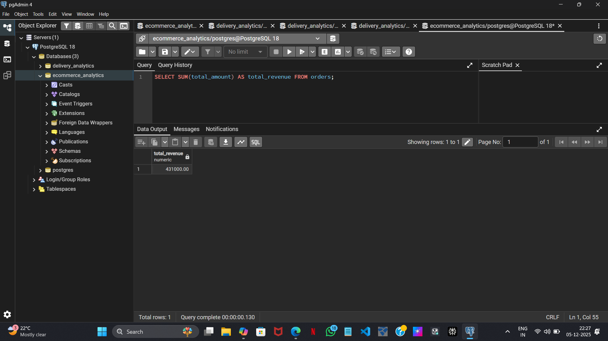
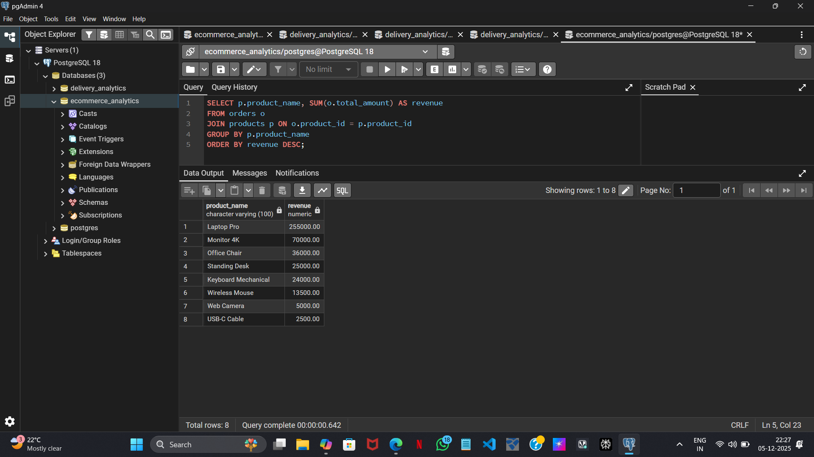
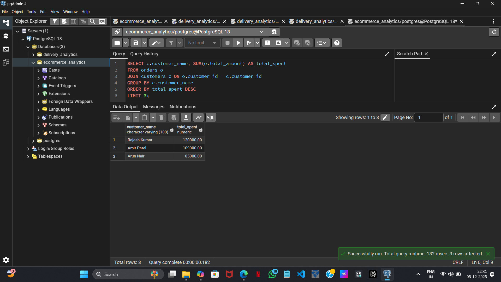
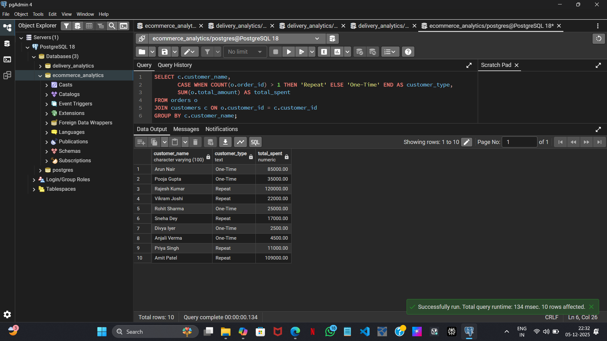
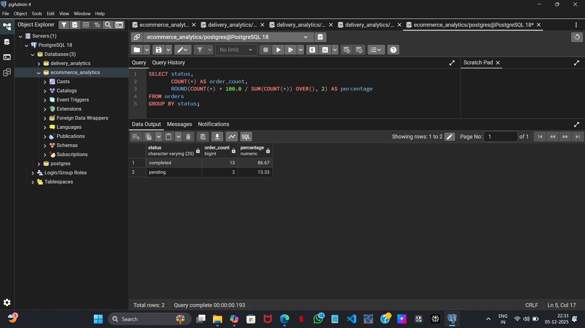

# Ecommerce Analytics Platform

This project analyzes transactional ecommerce data using PostgreSQL, Python, and Tableau. It automates SQL execution, exports validated CSV reports, and visualizes key business metrics.

---

## 🔧 Tech Stack

- **Database:** PostgreSQL (normalized schema: customers, products, orders)
- **ETL:** Python (pandas, psycopg2, SQLAlchemy)
- **Validation:** pandas checks + logging
- **Visualization:** Tableau Public

---

## 📊 Business Questions Answered

- What is the total revenue across all orders?
- Which products and categories drive the most revenue?
- Who are the top customers by spend?
- How does revenue vary by region?
- What is the split between repeat and one-time customers?
- What is the order completion rate?

---

## 📁 Project Structure
ecommerce-analytics/
├── pipeline.py
├── sql_queries/
│   └── analytics_queries.sql
├── data/
│   ├── revenue_by_product.csv
│   ├── top_customers.csv
│   ├── category_performance.csv
│   ├── repeat_vs_onetime.csv
│   └── pareto_analysis.csv
├── dashboards/
│   └── screenshots/
└── README.md

---

## 📸 Screenshots

### Total Revenue Query

### Top Customers (Pareto Analysis)

### Category Revenue Breakdown

### Repeat vs One-Time Customers

### Revenue by Region

### Order Completion Rate

---

## 📈 Tableau Dashboard

Live dashboard showing revenue breakdown, customer segmentation, and category performance:

🔗 [View Dashboard](https://public.tableau.com/views/Ecommerce_Analytics_17648662674710/Dashboard1)

---

## ✅ Key Insights

- **Total revenue:** ₹431,000  
- **Electronics category:** ₹370,000 (85.8% of total)  
- **Top 3 customers:** ₹314,000 (72.8% of revenue)  
- **Repeat customers:** ₹55,800 avg vs ₹30,400 one-time  
- **Order completion rate:** 86.67%

---

## 🚀 How to Run

1. Clone & setup
git clone https://github.com/13srilatha/ecommerce-analytics.git
cd ecommerce-analytics
python -m venv venv
source venv/bin/activate   # Mac/Linux
venv\Scripts\activate      # Windows
pip install -r requirements.txt

2. Configure database
- Ensure PostgreSQL is running
- Create a database: ecommerce_analytics
- Set .env with credentials:
DB_NAME=ecommerce_analytics
DB_USER=postgres
DB_PASSWORD=YOUR_PASSWORD
DB_HOST=localhost
DB_PORT=5432

3. Run schema + sample data
- Execute sql_queries/database_setup.sql in pgAdmin (creates tables + inserts sample rows)

4. Run pipeline
- python pipeline.py
- Executes all 10 SQL queries
- Exports 10 CSVs into /data (e.g. revenue_by_product_*.csv, pareto_analysis_*.csv)

---

## 📜 License

MIT License
